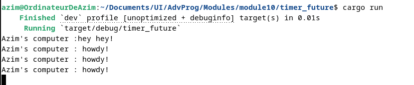

# Reflection

## 1.2 Understanding how it works

### Observations
I added a print after the spawner.spawn just like this : 

and here is what I get then:

### Explanations
- The message "Azim's computer :hey hey!" appears immediately after calling spawner.spawn(...), because that line runs in the main thread before the executor starts processing tasks.

- The spawned task is asynchronous — it is enqueued but not immediately executed.

- Making a spawn tasked does not block the main thread but will be handled later by the executor.

## 1.3 Multiple Spawn and removing drop

### Observations
I modified the code as asked, like this : 

and here is what I get then:

### Explanations
- Each spawn() call enqueues a separate asynchronous task. All tasks begin by printing "howdy!" and then sleep asynchronously for 2 seconds. After the timer elapses, each task continues and prints "done!".

- The output shows that the executor handles multiple tasks concurrently and schedules them independently.
